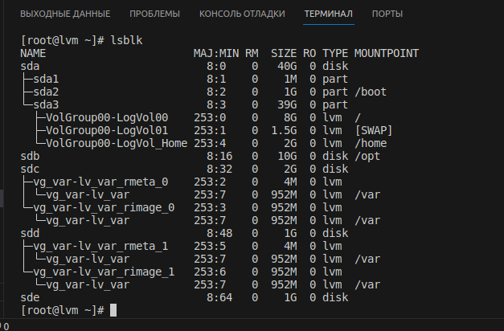

# ДЗ: Файловые системы и LVM

Имеется иходный образ vagrant с centos/7 1804.2 с несколькими дисками:

<details>

<summary>Вывод команды 'lsblk'</summary>

```
[vagrant@lvm ~]$ lsblk
NAME                    MAJ:MIN RM  SIZE RO TYPE MOUNTPOINT
sda                       8:0    0   40G  0 disk 
├─sda1                    8:1    0    1M  0 part 
├─sda2                    8:2    0    1G  0 part /boot
└─sda3                    8:3    0   39G  0 part 
  ├─VolGroup00-LogVol00 253:0    0 37.5G  0 lvm  /
  └─VolGroup00-LogVol01 253:1    0  1.5G  0 lvm  [SWAP]
sdb                       8:16   0   10G  0 disk 
sdc                       8:32   0    2G  0 disk 
sdd                       8:48   0    1G  0 disk 
sde                       8:64   0    1G  0 disk 
```

</details>


### 1. Задача: уменьшить том под / до 8G

Подготовим временный том для раздела "/" на устройстве /dev/sdb, для этого:
- создадим на нём Physical volume
  ```
  [vagrant@lvm ~]$ sudo -i
  [root@lvm ~]# pvcreate /dev/sdb
    Physical volume "/dev/sdb" successfully created.
  ```
- создадим Volume group
  ```
  [root@lvm ~]# vgcreate vg_root /dev/sdb
  Volume group "vg_root" successfully created
  ```
- создадим логический раздел "lv_root" использую всё свободное место
  ```
  [root@lvm ~]# lvcreate -n lv_root -l +100%FREE /dev/vg_root
  Logical volume "lv_root" created.
  ```

<details>

<summary>Проверим резульат (вывод команды 'lsblk')</summary>

```
[root@lvm ~]# lsblk
NAME                    MAJ:MIN RM  SIZE RO TYPE MOUNTPOINT
sda                       8:0    0   40G  0 disk 
├─sda1                    8:1    0    1M  0 part 
├─sda2                    8:2    0    1G  0 part /boot
└─sda3                    8:3    0   39G  0 part 
  ├─VolGroup00-LogVol00 253:0    0 37.5G  0 lvm  /
  └─VolGroup00-LogVol01 253:1    0  1.5G  0 lvm  [SWAP]
sdb                       8:16   0   10G  0 disk 
└─vg_root-lv_root       253:2    0   10G  0 lvm  
sdc                       8:32   0    2G  0 disk 
sdd                       8:48   0    1G  0 disk 
sde                       8:64   0    1G  0 disk 
```

</details>

---
Теперь создадим файловую систему на этом новом разделе:
```
[root@lvm ~]# mkfs.xfs /dev/vg_root/lv_root
meta-data=/dev/vg_root/lv_root   isize=512    agcount=4, agsize=655104 blks
         =                       sectsz=512   attr=2, projid32bit=1
         =                       crc=1        finobt=0, sparse=0
data     =                       bsize=4096   blocks=2620416, imaxpct=25
         =                       sunit=0      swidth=0 blks
naming   =version 2              bsize=4096   ascii-ci=0 ftype=1
log      =internal log           bsize=4096   blocks=2560, version=2
         =                       sectsz=512   sunit=0 blks, lazy-count=1
realtime =none                   extsz=4096   blocks=0, rtextents=0
```

и промонтируем её в `/mnt`
```
[root@lvm ~]# mount /dev/vg_root/lv_root /mnt
```

Сейчас раздел `"/"` находится на файловой системе xfs. Чтобы скопировать его на в `/mnt` следует установить утилиту `xfsdump`

<details>

<summary>Установка `xfsdump`</summary>


```
[root@lvm ~]# yum install xfsdump
Loaded plugins: fastestmirror
Loading mirror speeds from cached hostfile
 * base: mirror.docker.ru
 * extras: mirrors.powernet.com.ru
 * updates: mirrors.powernet.com.ru
Resolving Dependencies
--> Running transaction check
---> Package xfsdump.x86_64 0:3.1.7-3.el7_9 will be installed
--> Processing Dependency: attr >= 2.0.0 for package: xfsdump-3.1.7-3.el7_9.x86_64
--> Running transaction check
---> Package attr.x86_64 0:2.4.46-13.el7 will be installed
--> Finished Dependency Resolution

Dependencies Resolved

============================================================================================================================================
 Package                         Arch                           Version                               Repository                       Size
============================================================================================================================================
Installing:
 xfsdump                         x86_64                         3.1.7-3.el7_9                         updates                         309 k
Installing for dependencies:
 attr                            x86_64                         2.4.46-13.el7                         base                             66 k

Transaction Summary
============================================================================================================================================
Install  1 Package (+1 Dependent package)

Total download size: 374 k
Installed size: 1.1 M
Is this ok [y/d/N]: y
Downloading packages:
(1/2): attr-2.4.46-13.el7.x86_64.rpm                                                                                 |  66 kB  00:00:00     
(2/2): xfsdump-3.1.7-3.el7_9.x86_64.rpm                                                                              | 309 kB  00:00:00     
--------------------------------------------------------------------------------------------------------------------------------------------
Total                                                                                                       660 kB/s | 374 kB  00:00:00     
Running transaction check
Running transaction test
Transaction test succeeded
Running transaction
  Installing : attr-2.4.46-13.el7.x86_64                                                                                                1/2 
  Installing : xfsdump-3.1.7-3.el7_9.x86_64                                                                                             2/2 
  Verifying  : attr-2.4.46-13.el7.x86_64                                                                                                1/2 
  Verifying  : xfsdump-3.1.7-3.el7_9.x86_64                                                                                             2/2 

Installed:
  xfsdump.x86_64 0:3.1.7-3.el7_9                                                                                                            

Dependency Installed:
  attr.x86_64 0:2.4.46-13.el7                                                                                                               

Complete!
```

</details>

Скопируем раздел `"/"` в `/mnt`
```
[root@lvm ~]# xfsdump -J - /dev/VolGroup00/LogVol00 | xfsrestore -J - /mnt
xfsdump: using file dump (drive_simple) strategy
xfsdump: version 3.1.7 (dump format 3.0)
xfsdump: level 0 dump of lvm:/
xfsdump: dump date: Wed Dec 13 18:34:36 2023
xfsdump: session id: db2721d5-adac-4cb1-a915-54c23a4a6fa4
xfsdump: session label: ""
xfsrestore: using file dump (drive_simple) strategy
xfsrestore: version 3.1.7 (dump format 3.0)
xfsrestore: searching media for dump
xfsdump: ino map phase 1: constructing initial dump list
xfsdump: ino map phase 2: skipping (no pruning necessary)
xfsdump: ino map phase 3: skipping (only one dump stream)
xfsdump: ino map construction complete
xfsdump: estimated dump size: 881359040 bytes
xfsdump: creating dump session media file 0 (media 0, file 0)
xfsdump: dumping ino map
xfsdump: dumping directories
xfsrestore: examining media file 0
xfsrestore: dump description: 
xfsrestore: hostname: lvm
xfsrestore: mount point: /
xfsrestore: volume: /dev/mapper/VolGroup00-LogVol00
xfsrestore: session time: Wed Dec 13 18:34:36 2023
xfsrestore: level: 0
xfsrestore: session label: ""
xfsrestore: media label: ""
xfsrestore: file system id: b60e9498-0baa-4d9f-90aa-069048217fee
xfsrestore: session id: db2721d5-adac-4cb1-a915-54c23a4a6fa4
xfsrestore: media id: 7852300a-0915-4f4f-ad75-f4d14255fa4f
xfsrestore: searching media for directory dump
xfsrestore: reading directories
xfsdump: dumping non-directory files
xfsrestore: 2699 directories and 23623 entries processed
xfsrestore: directory post-processing
xfsrestore: restoring non-directory files
xfsdump: ending media file
xfsdump: media file size 858399608 bytes
xfsdump: dump size (non-dir files) : 845225248 bytes
xfsdump: dump complete: 15 seconds elapsed
xfsdump: Dump Status: SUCCESS
xfsrestore: restore complete: 15 seconds elapsed
xfsrestore: Restore Status: SUCCESS
```

Теперь сделаем синонимы в `/mnt` для каталогов `/proc, /sys, /dev, /run и /boot` 
```
[root@lvm ~]# for i in /proc/ /sys/ /dev/ /run/ /boot/; do mount --bind $i /mnt/$i; done
```

... и сделаем `chroot` в каталог `/mnt`
```
[root@lvm ~]# chroot /mnt/
[root@lvm /]# 
``` 

Теперь обновим `grub`
```
[root@lvm /]# grub2-mkconfig -o /boot/grub2/grub.cfg
Generating grub configuration file ...
Found linux image: /boot/vmlinuz-3.10.0-862.2.3.el7.x86_64
Found initrd image: /boot/initramfs-3.10.0-862.2.3.el7.x86_64.img
done
```

... и обновим образ `initrd`
```
[root@lvm /]# cd /boot ; for i in `ls initramfs-*img`; do dracut -v $i `echo $i|sed "s/initramfs-//g; s/.img//g"` --force; done
Executing: /sbin/dracut -v initramfs-3.10.0-862.2.3.el7.x86_64.img 3.10.0-862.2.3.el7.x86_64 --force
dracut module 'busybox' will not be installed, because command 'busybox' could not be found!
dracut module 'crypt' will not be installed, because command 'cryptsetup' could not be found!
dracut module 'dmraid' will not be installed, because command 'dmraid' could not be found!
dracut module 'dmsquash-live-ntfs' will not be installed, because command 'ntfs-3g' could not be found!
dracut module 'multipath' will not be installed, because command 'multipath' could not be found!
dracut module 'busybox' will not be installed, because command 'busybox' could not be found!
dracut module 'crypt' will not be installed, because command 'cryptsetup' could not be found!
dracut module 'dmraid' will not be installed, because command 'dmraid' could not be found!
dracut module 'dmsquash-live-ntfs' will not be installed, because command 'ntfs-3g' could not be found!
dracut module 'multipath' will not be installed, because command 'multipath' could not be found!
*** Including module: bash ***
*** Including module: nss-softokn ***
*** Including module: i18n ***
*** Including module: drm ***
*** Including module: plymouth ***
*** Including module: dm ***
Skipping udev rule: 64-device-mapper.rules
Skipping udev rule: 60-persistent-storage-dm.rules
Skipping udev rule: 55-dm.rules
*** Including module: kernel-modules ***
Omitting driver floppy
*** Including module: lvm ***
Skipping udev rule: 64-device-mapper.rules
Skipping udev rule: 56-lvm.rules
Skipping udev rule: 60-persistent-storage-lvm.rules
*** Including module: qemu ***
*** Including module: resume ***
*** Including module: rootfs-block ***
*** Including module: terminfo ***
*** Including module: udev-rules ***
Skipping udev rule: 40-redhat-cpu-hotplug.rules
Skipping udev rule: 91-permissions.rules
*** Including module: biosdevname ***
*** Including module: systemd ***
*** Including module: usrmount ***
*** Including module: base ***
*** Including module: fs-lib ***
*** Including module: shutdown ***
*** Including modules done ***
*** Installing kernel module dependencies and firmware ***
*** Installing kernel module dependencies and firmware done ***
*** Resolving executable dependencies ***
*** Resolving executable dependencies done***
*** Hardlinking files ***
*** Hardlinking files done ***
*** Stripping files ***
*** Stripping files done ***
*** Generating early-microcode cpio image contents ***
*** No early-microcode cpio image needed ***
*** Store current command line parameters ***
*** Creating image file ***
*** Creating image file done ***
*** Creating initramfs image file '/boot/initramfs-3.10.0-862.2.3.el7.x86_64.img' done ***
```

В файле `/boot/grub2/grub.cfg` меняем `rd.lvm.lv=VolGroup00/LogVol00` на `rd.lvm.lv=vg_root/lv_root` для того, чтобы `"/"` при загрузке примнтировался из нашего временного раздела `lv_root` 
```
[root@lvm boot]# sed -i 's/rd.lvm.lv=VolGroup00\/LogVol00/rd.lvm.lv=vg_root\/lv_root/g' /boot/grub2/grub.cfg
```

---
Теперь перезагружаемся и проверяем вывод `lsblk`
```
[root@lvm boot]# reboot
Connection to 127.0.0.1 closed by remote host.
user@intel:~/Nextcloud/Документы/OTUS/OTUS-Task3/vagrant$ vagrant ssh
Last login: Wed Dec 13 18:06:10 2023 from 10.0.2.2
[vagrant@lvm ~]$ lsblk
NAME                    MAJ:MIN RM  SIZE RO TYPE MOUNTPOINT
sda                       8:0    0   40G  0 disk 
├─sda1                    8:1    0    1M  0 part 
├─sda2                    8:2    0    1G  0 part /boot
└─sda3                    8:3    0   39G  0 part 
  ├─VolGroup00-LogVol01 253:1    0  1.5G  0 lvm  [SWAP]
  └─VolGroup00-LogVol00 253:2    0 37.5G  0 lvm  
sdb                       8:16   0   10G  0 disk 
└─vg_root-lv_root       253:0    0   10G  0 lvm  /
sdc                       8:32   0    2G  0 disk 
sdd                       8:48   0    1G  0 disk 
sde                       8:64   0    1G  0 disk 
```

Видим, что раздел `"/"` примонтирован с устройства `sdb`. Теперь можно уменьшить раздел `VolGroup00-LogVol00`, а именно удалим его и создадим новый нужного размера
```
[root@lvm ~]# lvremove /dev/VolGroup00/LogVol00
Do you really want to remove active logical volume VolGroup00/LogVol00? [y/n]: y
  Logical volume "LogVol00" successfully removed
[root@lvm ~]# lvcreate -n VolGroup00/LogVol00 -L 8G /dev/VolGroup00
WARNING: xfs signature detected on /dev/VolGroup00/LogVol00 at offset 0. Wipe it? [y/n]: y
  Wiping xfs signature on /dev/VolGroup00/LogVol00.
  Logical volume "LogVol00" created.
```

Создадим на нём файловую систему
```
[root@lvm ~]# mkfs.xfs /dev/VolGroup00/LogVol00
meta-data=/dev/VolGroup00/LogVol00 isize=512    agcount=4, agsize=524288 blks
         =                       sectsz=512   attr=2, projid32bit=1
         =                       crc=1        finobt=0, sparse=0
data     =                       bsize=4096   blocks=2097152, imaxpct=25
         =                       sunit=0      swidth=0 blks
naming   =version 2              bsize=4096   ascii-ci=0 ftype=1
log      =internal log           bsize=4096   blocks=2560, version=2
         =                       sectsz=512   sunit=0 blks, lazy-count=1
realtime =none                   extsz=4096   blocks=0, rtextents=0
```

и примонтируем его в `/mnt`
```
[root@lvm ~]# mount /dev/VolGroup00/LogVol00 /mnt
```

Переносим `"/"` на новый раздел
```
[root@lvm ~]# xfsdump -J - /dev/vg_root/lv_root | xfsrestore -J - /mnt
xfsdump: using file dump (drive_simple) strategy
xfsdump: version 3.1.7 (dump format 3.0)
xfsdump: level 0 dump of lvm:/
xfsdump: dump date: Wed Dec 13 19:05:26 2023
xfsdump: session id: 4b743b10-fab8-421b-927d-18b20abe1dbe
xfsdump: session label: ""
xfsrestore: using file dump (drive_simple) strategy
xfsrestore: version 3.1.7 (dump format 3.0)
xfsrestore: searching media for dump
xfsdump: ino map phase 1: constructing initial dump list
xfsdump: ino map phase 2: skipping (no pruning necessary)
xfsdump: ino map phase 3: skipping (only one dump stream)
xfsdump: ino map construction complete
xfsdump: estimated dump size: 879972096 bytes
xfsdump: creating dump session media file 0 (media 0, file 0)
xfsdump: dumping ino map
xfsdump: dumping directories
xfsrestore: examining media file 0
xfsrestore: dump description: 
xfsrestore: hostname: lvm
xfsrestore: mount point: /
xfsrestore: volume: /dev/mapper/vg_root-lv_root
xfsrestore: session time: Wed Dec 13 19:05:26 2023
xfsrestore: level: 0
xfsrestore: session label: ""
xfsrestore: media label: ""
xfsrestore: file system id: c4554ef3-68d2-4fb3-b961-3308a6a0715f
xfsrestore: session id: 4b743b10-fab8-421b-927d-18b20abe1dbe
xfsrestore: media id: 0d65bd11-b6c7-475f-b10c-021399677da2
xfsrestore: searching media for directory dump
xfsrestore: reading directories
xfsdump: dumping non-directory files
xfsrestore: 2703 directories and 23628 entries processed
xfsrestore: directory post-processing
xfsrestore: restoring non-directory files
xfsdump: ending media file
xfsdump: media file size 857025176 bytes
xfsdump: dump size (non-dir files) : 843847120 bytes
xfsdump: dump complete: 20 seconds elapsed
xfsdump: Dump Status: SUCCESS
xfsrestore: restore complete: 20 seconds elapsed
xfsrestore: Restore Status: SUCCESS
```

Создадим синонимы для основных каталогов
```
[root@lvm ~]# for i in /proc/ /sys/ /dev/ /run/ /boot/; do mount --bind $i /mnt/$i; done
```

Сделаем `chroot` в `/mnt` и снова переконфигурируем `grub` и `initrd`
```
[root@lvm ~]# chroot /mnt/
[root@lvm /]# grub2-mkconfig -o /boot/grub2/grub.cfg
Generating grub configuration file ...
Found linux image: /boot/vmlinuz-3.10.0-862.2.3.el7.x86_64
Found initrd image: /boot/initramfs-3.10.0-862.2.3.el7.x86_64.img
done
[root@lvm /]# cd /boot ; for i in `ls initramfs-*img`; do dracut -v $i `echo $i|sed "s/initramfs-//g; s/.img//g"` --force; done
Executing: /sbin/dracut -v initramfs-3.10.0-862.2.3.el7.x86_64.img 3.10.0-862.2.3.el7.x86_64 --force
dracut module 'busybox' will not be installed, because command 'busybox' could not be found!
dracut module 'crypt' will not be installed, because command 'cryptsetup' could not be found!
dracut module 'dmraid' will not be installed, because command 'dmraid' could not be found!
dracut module 'dmsquash-live-ntfs' will not be installed, because command 'ntfs-3g' could not be found!
dracut module 'multipath' will not be installed, because command 'multipath' could not be found!
dracut module 'busybox' will not be installed, because command 'busybox' could not be found!
dracut module 'crypt' will not be installed, because command 'cryptsetup' could not be found!
dracut module 'dmraid' will not be installed, because command 'dmraid' could not be found!
dracut module 'dmsquash-live-ntfs' will not be installed, because command 'ntfs-3g' could not be found!
dracut module 'multipath' will not be installed, because command 'multipath' could not be found!
*** Including module: bash ***
*** Including module: nss-softokn ***
*** Including module: i18n ***
*** Including module: drm ***
*** Including module: plymouth ***
*** Including module: dm ***
Skipping udev rule: 64-device-mapper.rules
Skipping udev rule: 60-persistent-storage-dm.rules
Skipping udev rule: 55-dm.rules
*** Including module: kernel-modules ***
Omitting driver floppy
*** Including module: lvm ***
Skipping udev rule: 64-device-mapper.rules
Skipping udev rule: 56-lvm.rules
Skipping udev rule: 60-persistent-storage-lvm.rules
*** Including module: qemu ***
*** Including module: resume ***
*** Including module: rootfs-block ***
*** Including module: terminfo ***
*** Including module: udev-rules ***
Skipping udev rule: 40-redhat-cpu-hotplug.rules
Skipping udev rule: 91-permissions.rules
*** Including module: biosdevname ***
*** Including module: systemd ***
*** Including module: usrmount ***
*** Including module: base ***
*** Including module: fs-lib ***
*** Including module: shutdown ***
*** Including modules done ***
*** Installing kernel module dependencies and firmware ***
*** Installing kernel module dependencies and firmware done ***
*** Resolving executable dependencies ***
*** Resolving executable dependencies done***
*** Hardlinking files ***
*** Hardlinking files done ***
*** Stripping files ***
*** Stripping files done ***
*** Generating early-microcode cpio image contents ***
*** No early-microcode cpio image needed ***
*** Store current command line parameters ***
*** Creating image file ***
*** Creating image file done ***
*** Creating initramfs image file '/boot/initramfs-3.10.0-862.2.3.el7.x86_64.img' done ***
```

Теперь можно перезагрузиться, но сначала выполним другие задания.

---

### Задача: выделить том под /var (/var - сделать в mirror)

Сначала перенесём `/var`. Для этого создадим lvm-зеркало на дисках `/dev/sdc` и `/dev/sdd`
```
[root@lvm boot]# pvcreate /dev/sdc /dev/sdd
  Physical volume "/dev/sdc" successfully created.
  Physical volume "/dev/sdd" successfully created.
[root@lvm boot]# vgcreate vg_var /dev/sdc /dev/sdd
  Volume group "vg_var" successfully created
[root@lvm boot]# lvcreate -L 950M -m1 -n lv_var vg_var
  Rounding up size to full physical extent 952.00 MiB
  Logical volume "lv_var" created.
```
Теперь создадим на новом разделе файловую систему `ext4`, примонтируем её в `/mnt` и скопируем туда каталог `/var`
```
[root@lvm boot]# mkfs.ext4 /dev/vg_var/lv_var
mke2fs 1.42.9 (28-Dec-2013)
Filesystem label=
OS type: Linux
Block size=4096 (log=2)
Fragment size=4096 (log=2)
Stride=0 blocks, Stripe width=0 blocks
60928 inodes, 243712 blocks
12185 blocks (5.00%) reserved for the super user
First data block=0
Maximum filesystem blocks=249561088
8 block groups
32768 blocks per group, 32768 fragments per group
7616 inodes per group
Superblock backups stored on blocks: 
        32768, 98304, 163840, 229376

Allocating group tables: done                            
Writing inode tables: done                            
Creating journal (4096 blocks): done
Writing superblocks and filesystem accounting information: done

```
```
[root@lvm boot]# mount /dev/vg_var/lv_var /mnt
```
```
[root@lvm boot]# cp -aR /var/* /mnt/
```
Создадим в `/tmp` каталог `oldvar` и переместим туда старый `/var`
```
[root@lvm boot]# mkdir /tmp/oldvar && mv /var/* /tmp/oldvar
```

Теперь отмонтируем новый раздел, куда скопирован `/var` от `/mnt` и примонтируем его на место, в `/var`
```
[root@lvm boot]# umount /mnt
```

```
[root@lvm boot]# mount /dev/vg_var/lv_var /var
```

Чтобы после перезагрузки `/var` примонтровался с нужного раздела, получим UUID, сформируем строку для `fstab` и добавим её в `/etc/fstab`

```
[root@lvm boot]# echo "`blkid | grep var: | awk '{print $2}'` /var ext4 defaults 0 0" >> /etc/fstab
```

Выходим из `/chroot`, перезагружаемся и удаляем не нужный больше раздел `lv_root`

```
[vagrant@lvm ~]$ sudo -i
[root@lvm ~]# lvremove /dev/vg_root/lv_root
Do you really want to remove active logical volume vg_root/lv_root? [y/n]: y
  Logical volume "lv_root" successfully removed
[root@lvm ~]# vgremove /dev/vg_root
  Volume group "vg_root" successfully removed
[root@lvm ~]# pvremove /dev/sdb
  Labels on physical volume "/dev/sdb" successfully wiped.
[root@lvm ~]# lsblk
NAME                     MAJ:MIN RM  SIZE RO TYPE MOUNTPOINT
sda                        8:0    0   40G  0 disk 
├─sda1                     8:1    0    1M  0 part 
├─sda2                     8:2    0    1G  0 part /boot
└─sda3                     8:3    0   39G  0 part 
  ├─VolGroup00-LogVol00  253:0    0    8G  0 lvm  /
  └─VolGroup00-LogVol01  253:1    0  1.5G  0 lvm  [SWAP]
sdb                        8:16   0   10G  0 disk 
sdc                        8:32   0    2G  0 disk 
├─vg_var-lv_var_rmeta_0  253:2    0    4M  0 lvm  
│ └─vg_var-lv_var        253:7    0  952M  0 lvm  /var
└─vg_var-lv_var_rimage_0 253:3    0  952M  0 lvm  
  └─vg_var-lv_var        253:7    0  952M  0 lvm  /var
sdd                        8:48   0    1G  0 disk 
├─vg_var-lv_var_rmeta_1  253:5    0    4M  0 lvm  
│ └─vg_var-lv_var        253:7    0  952M  0 lvm  /var
└─vg_var-lv_var_rimage_1 253:6    0  952M  0 lvm  
  └─vg_var-lv_var        253:7    0  952M  0 lvm  /var
sde                        8:64   0    1G  0 disk 
```

---
### Задача: выделить том под /home, для /home сделать том для снэпшотов

Сдедаем том для  `/home`
```
[root@lvm ~]# lvcreate -n LogVol_Home -L 2G /dev/VolGroup00
  Logical volume "LogVol_Home" created.
```

Создадим файловую систему на томе
```
[root@lvm ~]# mkfs.xfs /dev/VolGroup00/LogVol_Home
meta-data=/dev/VolGroup00/LogVol_Home isize=512    agcount=4, agsize=131072 blks
         =                       sectsz=512   attr=2, projid32bit=1
         =                       crc=1        finobt=0, sparse=0
data     =                       bsize=4096   blocks=524288, imaxpct=25
         =                       sunit=0      swidth=0 blks
naming   =version 2              bsize=4096   ascii-ci=0 ftype=1
log      =internal log           bsize=4096   blocks=2560, version=2
         =                       sectsz=512   sunit=0 blks, lazy-count=1
realtime =none                   extsz=4096   blocks=0, rtextents=0
```

Примонтируем эту файловую систему в `/mnt`, скопируем туда каталог `/home`, удалим всё в старом `/home`, отмонтируем новый раздел от `/mnt` и примонтируем его в /home
```
[root@lvm ~]# mount /dev/VolGroup00/LogVol_Home /mnt/
[root@lvm ~]# cp -aR /home/* /mnt/
[root@lvm ~]# rm -rf /home/*
[root@lvm ~]# umount /mnt
[root@lvm ~]# mount /dev/VolGroup00/LogVol_Home /home/
```

 Добавим соответствующуб запись в `fstab`
 ```
 [root@lvm ~]# echo "`blkid | grep Home | awk '{print $2}'` /home xfs defaults 0 0" >> /etc/fstab
 ```

Создадим в `/home` файлы
```
touch /home/file{1..20}
```

Снимем снапшот
```
[root@lvm ~]# lvcreate -L 100MB -s -n home_snap /dev/VolGroup00/LogVol_Home
  Rounding up size to full physical extent 128.00 MiB
  Logical volume "home_snap" created.
```

Удалим часть файлов
```
[root@lvm ~]# rm -f /home/file{11..20}
[root@lvm ~]# ls /home/
file1  file10  file2  file3  file4  file5  file6  file7  file8  file9  vagrant
``` 

Теперь отмонтируем `/home`, восстановим его из снапшота, примонтируем обратно и посмотрим содержимое
```
[root@lvm ~]# umount /home
[root@lvm ~]# lvconvert --merge /dev/VolGroup00/home_snap
  Merging of volume VolGroup00/home_snap started.
  VolGroup00/LogVol_Home: Merged: 100.00%
[root@lvm ~]# mount /home
[root@lvm ~]# ls /home/
file1   file11  file13  file15  file17  file19  file20  file4  file6  file8  vagrant
file10  file12  file14  file16  file18  file2   file3   file5  file7  file9
```

---
### Задача: поставить btrfs с кешем и снэпшотами и разметить здесь каталог /opt

Установим btrfs на устройство `/dev/sdb`, примонтируем его в `/mnt` и проверим, что получилось, командой `df -T`
```
[root@lvm ~]# mkfs.btrfs /dev/sdb
btrfs-progs v4.9.1
See http://btrfs.wiki.kernel.org for more information.

Label:              (null)
UUID:               756c0b14-ab12-48c0-8c23-10836049457a
Node size:          16384
Sector size:        4096
Filesystem size:    10.00GiB
Block group profiles:
  Data:             single            8.00MiB
  Metadata:         DUP               1.00GiB
  System:           DUP               8.00MiB
SSD detected:       no
Incompat features:  extref, skinny-metadata
Number of devices:  1
Devices:
   ID        SIZE  PATH
    1    10.00GiB  /dev/sdb

[root@lvm ~]# mount /dev/sdb /mnt
[root@lvm ~]# df -T
Filesystem                         Type     1K-blocks   Used Available Use% Mounted on
/dev/mapper/VolGroup00-LogVol00    xfs        8378368 897416   7480952  11% /
devtmpfs                           devtmpfs    111876      0    111876   0% /dev
tmpfs                              tmpfs       120692      0    120692   0% /dev/shm
tmpfs                              tmpfs       120692   4516    116176   4% /run
tmpfs                              tmpfs       120692      0    120692   0% /sys/fs/cgroup
/dev/sda2                          xfs        1038336  62216    976120   6% /boot
/dev/mapper/vg_var-lv_var          ext4        943128 257080    620924  30% /var
/dev/mapper/VolGroup00-LogVol_Home xfs        2086912  32992   2053920   2% /home
/dev/sdb                           btrfs     10485760  16896   8370944   1% /mnt
```

Каталог `/opt` оказался пуст, поэтому просто отмонтируем `/dev/sdb` от `/mnt` и примонтируем в `/opt` `/dev/sdb`, потом добавим запись в `/etc/fstab`
```
[root@lvm ~]# umount /mnt
[root@lvm ~]# mount /dev/sdb /opt/
[root@lvm ~]# echo "`blkid | grep btrfs | awk '{print $2}'` /opt btrfs defaults 0 0" >> /etc/fstab 
```

Проверим, что раздел успешно монтируется
```
[root@lvm ~]# mount -a
[root@lvm ~]# df -h
Filesystem                          Size  Used Avail Use% Mounted on
/dev/mapper/VolGroup00-LogVol00     8.0G  877M  7.2G  11% /
devtmpfs                            110M     0  110M   0% /dev
tmpfs                               118M     0  118M   0% /dev/shm
tmpfs                               118M  4.5M  114M   4% /run
tmpfs                               118M     0  118M   0% /sys/fs/cgroup
/dev/sda2                          1014M   61M  954M   6% /boot
/dev/mapper/vg_var-lv_var           922M  252M  607M  30% /var
/dev/mapper/VolGroup00-LogVol_Home  2.0G   33M  2.0G   2% /home
/dev/sdb                             10G   17M  8.0G   1% /opt
```

Вывод итоговой команды `lsblk` на скриншоте:

